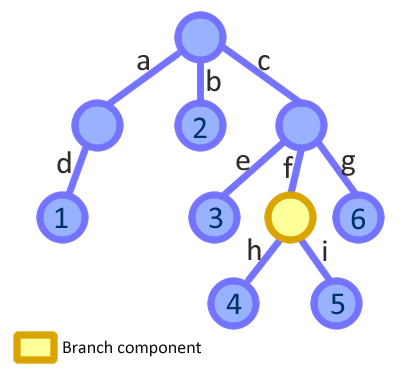
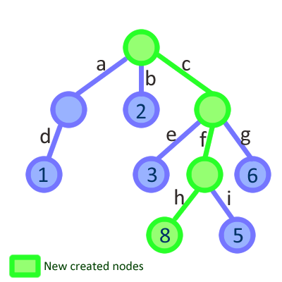

# Curxor

A tree data structure that is always updated from the root, even if the modification is triggered by one of the leaves, making easier to think in a reactive way.

Curxor is made with React.js in mind, to be an utility or a replacement for the flux architecture. 

What makes Curxor special is:

* Immutable trees to make fast comparison among nodes.
* Eventful nodes to notify updates to other parts of the app.
* No dependencies.
* Lightweight: ~7KB minified (much less if gzipped).
* Packaged as UMD module to be loaded everywhere.

## Example of use
```js
// Browserify/Node style of loading
var Curxor = require('curxor');

// Let's create a curxor store
var store = new Curxor({
    a: {x: 1, y: 2, z: [0, 1, 2] },
    b: [ 5, 6, 7 , { m: 1, n: 2 } ],
    c: 'Hola',
    d: null // It is possible to store whatever
});

// Let's get the data stored
var data = store.getData();

// Listen on changes in the store
store.on('update', function(){
    console.log( 'I was updated' );
});

// The data is read as usual
console.log( data.c ); // logs 'Hola'

// And used as usual
data.a.z.forEach( function( item ){
    console.log( item );
}); // logs 0, 1 and 2

// But it is immutable, so...
data.d = 3; console.log( data.d ); // logs null
data.e = 4; console.log( data.e ); // logs undefined

// to update use methods like set
var updated = data.set( 'e', 4 ); // On next tick it will log 'I was updated'

console.log( data.e ); // Still logs undefined
console.log( updated.e ); // logs 4

// Store data has changed!
store.getData() !== data; // true
store.getData() === updated; // true

// The nodes that weren't updated are reused
data.a === updated.a; // true
data.b === updated.b; // true

// Updates can be chained because the new immutable
// store node is always returned
var updatedB = updated.b.push( 100 )
    .shift()
    .set(0, 'Updated')
; // It will log 'I was updated' on next tick, just once

// updatedB is the current b property
store.getData().b === updatedB; // true

// And it is different from the one that started
updated !== store.getData(); // true
updated.b !== updatedB; // true
console.log( updated.b[0] ); // updated did't/can't change: logs 5
console.log( updatedB[0] ); // logs 'Updated'
console.log( updatedB[4] ); // logs 100
updatedB.length === 5; // true: We added 2 elements and removed 1

// Untouched nodes are still the same
data.a === store.getData().a; // still true
updated.a === store.getData().a; // still true

// Reverting to a previous state is as easy as
// set the data again (Undo/redo made easy)
store.setData( data ); // It will log 'I was updated' on next tick

store.getData() === data; // true
```


## Why another store?

**Curxor** is inspired by some other tree cursors libraries, specially [Cortex](https://github.com/mquan/cortex) that try to solve an inconvenient of the Flux architecture:

* If you have a store with deep nested data and you need to update some value from a child component that reflect that data, you need to dispatch an action and from the top of the store look for the bit of data again to update it. That may involve a lot of extra code to propagate the change and it is more painful when you think that the component knew already what data to update.

In the other hand, that the data changes always flow in the same direction is what make Flux architecure so easy to reason about. If we let every component to update the data independently we are building a mess again.

So *Curxor*, instead of letting the child component to update the data directly, it gives to the component the tools to require the change. The updates are always made by the root of the store and the data can keep flowing just in one direction.

Imagine that we have the following tree structure as our app store: 

And we have a component responsible of handling the `store.c.f` ( the yellow node ) part of the data. Its scope is just that part of the tree, so the component receives it as a prop:
```js
// The component receives a part of the curxor data
this.props.branch = { h: 4, i: 5};
```
Eventually the component is used to update `store.c.f.h = 8`. With *Curxor* instead of dispatching an action, as it would be done with *Flux*, those kind of changes can be done using the data itself:
```js
this.props.branch.set( {h: 8} );
```
Then, *Curxor* will create a new immutable data structure starting from the top of the tree, and our component will receive a new branch to render. The store finished like this: 

Since the whole tree is updated, we can have the main app state in one single object and make the top level components re-render in a reactive way to changes that are made deep in the store hierarchy.

**Curxor** is very influenced by the way that [Facebook's Immutable](https://github.com/facebook/immutable-js) handles immutabilty. It creates a new tree every time that a modification is required referencing the non modified nodes from the previous tree. Sharing node references among immutable objects saves memory and boost the performance on creating new immutables.

Using immutability with React is great, because you don't need to make deep comparisons in order to know when to update a component:
```js
shouldComponentUpdate: function( nextProps ){

    // The comparison is fast, and we won't render the component if
    // it does not need it. This is a huge gain in performance.
    return this.props.store != nextProps.store;
}
```

*Curxor* has less features than *Immutable*, but its API is simpler and it is much more lightweight (Minified, Immutable is ~56KB and Curxor ~7KB).

## API

Create a curxor object using the constructor:
```js
var store = new Curxor({a: 'hola', b:[1,2, [3,4,5]], c: false });
```
And then, Curxor API is really simple and only have 2 methods: `getData` and `setData`. A curxor object also implements the [listener API](#listener-api).

#### getData()

Returns an immutable object with the curxor data.
```js
// Logs: {a: 'hola', b:[1,2, [3,4,5]], c: false }
console.log( store.getData() ); 
```
The data returned is actually formed by arrays and objects, but they are sealed to prevent their mutation and they have some methods in them to update the curxor.
Everytime an update is performed, `getData` will return a new immutable object.

#### setData( data )

Replace the current curxor data with new one.
```js

// An example on how to undo an update would be like this...
var store = new Curxor({a: 'hola', b:[1,2, [3,4,5]], c: false }),
    data = store.getData()
;

var updated = data.set({c: true});
console.log( updated.c ); // true

// Restore the inital state
store.setData( data );
console.log( store.getData().c ); // false
```

#### Events

Every time that the data is updated, an `update` event is triggered on the cursor. In order to use those events use `on`, `once` and `off` methods provided by the Listener API that the curxor object implements.

## Update methods

Curxor data has three different types of nodes: *Hashes*, *Arrays* and *leaf nodes*. A leaf node can't be updated by itself and it need to be updated using its parent node. Every updating method return a new immutable object with the new node result of the update:
```js
var store = new Curxor({obj: {a:'hola', b:'adios'}, arr: [1,2]});

var updatedObj = store.getData().obj.update('a', 'hello');
console.log( updatedObj ); // {a:'hello', b:'adios'}

var updatedArr = store.getData().arr.unshift( 0 );
console.log( udpatedArr ); // [0,1,2]

// {obj: {a:'hello', b:'adios'}, arr: [0,1,2]}
console.log( store.getData() ); 
```

 Both, *Array* and *Hashes* have a `set` method to update or add elements.

#### set( keyOrHash, value )
Arrays and hashes can update their children using the `set` method. It accepts a hash with the keys and values to update or two arguments, the key and the value.
```js
var store = new Curxor({obj: {a:'hola', b:'adios'}, arr: [1,2]});

// Updating using a hash
store.getdata().obj.set( {b:'bye', c:'ciao'} );

// Updating using key and value
store.getData().arr.set( 0, 0 );

// {obj: {a:'hola', b:'bye', c:'ciao'}, arr: [0,2]}
console.log( store.getData() )
```

## Hash methods
#### remove( keyOrKeys )
Removes elements from a hash node. It accepts a string or an array with the names of the strings to remove.

```js
var store = new Curxor({a:'hola', b:'adios', c:'hello', d:'bye'});

var updated = store.getData()
    .remove('d') // Removing an element
    .remove(['b', 'c']) // Removing two elements
;

console.log( updated ); //{a: 'hola'}
```

## Array methods
Array nodes have modified versions of the `push`, `pop`, `unshift`, `shift` and `splice` methods that update the cursor and return the new node, instead of updating the immutable array node ( that would be impossible ).
```js
var store = new Cursor({ arr: [0,1,2,3,4] });

store.getData().arr
    .push( 5 ) // [0,1,2,3,4,5]
    .pop() // [0,1,2,3,4]
    .unshift( 'a' ) // ['a',0,1,2,3,4]
    .shift() // [0,1,2,3,4]
    .splice( 1, 1, 'a', 'b') // [ 0, 'a', 'b', 2, 3, 4]
;
```

Array nodes also have the `append` and `prepend` methods to batch insert elements at the begining or the end of the array.
```js
var store = new Cursor({ arr: [2] });

store.getData().arr
    .prepend([0,1]) // [0,1,2]
    .append([3,4]) // [0,1,2,3,4]
;
```

## Events
Curxor objects emit `update` events whenever their data changes. It is also possible to listen to `update` events in a intermediate node by creating a listener on it using the method `getListener`.

#### getListener()
Returns a listener that emits an `update` event when the node is updated. The listener implements the [listener API](#listener-api).
```js
var store = new Cursor({ arr: [2] }),
    data = store.getData(),
    listener = data.arr.getListener()
;

listener.on('update', function( data ){
    console.log( 'Updated!' );
    console.log( data );
});

data.arr.push( 3 ); //logs 'Updated!' [2,3]
```

## Listener API
Curxor stores and listener implements this API that is influenced by the way Backbone handle events. The only event that Curxor emits is `update`, end is emitted on every curxor/node update.

#### on( eventName, callback )
Register a function to be called when an event occurs.
#### once( eventName, callback )
Register a function to be called once when an event occurs. After being called the callback is unregistered.
#### off( eventName, callback )
Can unregister all callbacks from a listener if the `eventName` parameter is omitted, or all the callbacks for a `eventName` if the `callback` parameter is omitted.
#### trigger( eventName [, param, param, ...] )
Trigger an event on the listener. All the extra parameters will be passed to the registered callbacks.